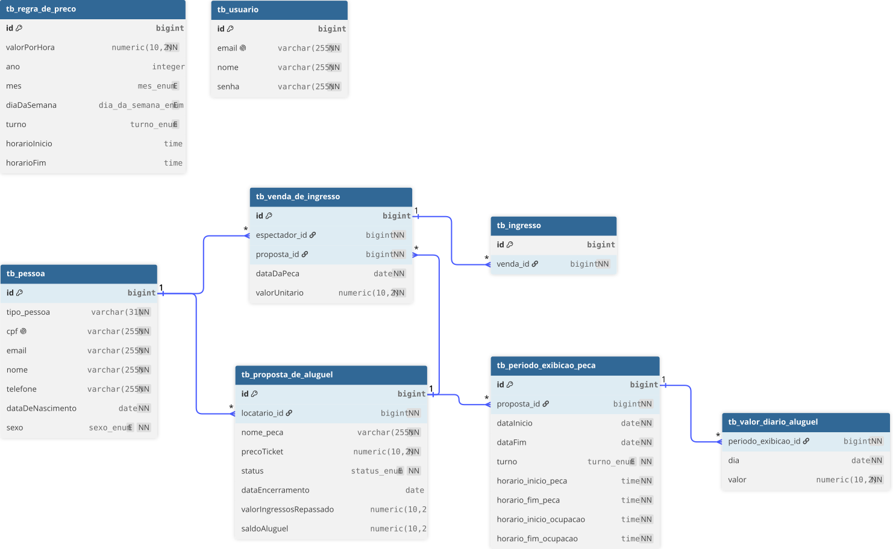

# Projeto I de Banco de Dados II

## Objetivo

Implementar JPA no projeto desenvolvido na disciplina de POO do período anterior.

## Diagrama do banco de dados

### Explicações

O diagrama representa a estrutura do banco de dados após o mapeamento das entidades com JPA/Hibernate.

- **Pessoa, Locatário e Espectador:** a herança foi mapeada utilizando a estratégia `SINGLE_TABLE`. Por esse motivo, `Locatario` e `Espectador` não possuem tabelas próprias. Os dados são armazenados em `tb_pessoa`, e a coluna `tipo_pessoa` identifica o tipo correspondente de cada registro.
- **Peça:** a classe `Peca` foi mapeada como `@Embeddable`, pois não possui identidade ou ciclo de vida independente. Dessa forma, não existe uma tabela específica para peça. Seu atributo `nome` é armazenado na coluna `nome_peca` da tabela `tb_proposta_de_aluguel`.
- **Período de exibição:** cada proposta pode possuir vários períodos de exibição. Por isso, `tb_periodo_exibicao_peca` possui a chave estrangeira `proposta_id`, relacionando cada período com sua respectiva proposta.
- **Valores diários de aluguel:** a classe `ControleValorDiarioAluguel` não é uma entidade independente. Seus dados fazem parte de cada período de exibição e são armazenados na tabela `tb_valor_diario_aluguel` por meio de `@ElementCollection`. A coluna `periodo_exibicao_id` indica a qual período cada valor diário pertence.
- **Venda de ingressos:** cada venda está associada a um espectador e a uma proposta de aluguel. Essas associações são representadas pelas chaves estrangeiras `espectador_id` e `proposta_id` em `tb_venda_de_ingresso`.
- **Ingressos:** uma venda pode gerar vários ingressos. A tabela `tb_ingresso` possui a chave estrangeira `venda_id`, responsável pela associação com a venda que originou o ingresso.
- **Regra de preço:** `tb_regra_de_preco` não possui relacionamento direto com outras tabelas. As regras são consultadas pela aplicação para realizar o cálculo dos valores de aluguel, sem a necessidade de manter uma associação persistente com os períodos de exibição.
- **Usuário:** `tb_usuario` é independente das demais tabelas e armazena os dados utilizados para acesso ao sistema.

### Relacionamentos

Os relacionamentos entre as entidades foram mapeados de acordo com a forma como os objetos são utilizados no sistema:

- **`PropostaDeAluguel` e `Locatario`:** relacionamento **N:1 unidirecional** (`@ManyToOne`). Várias propostas podem pertencer ao mesmo locatário, enquanto `Locatario` não mantém uma coleção de propostas.
- **`PropostaDeAluguel` e `PeriodoExibicaoPeca`:** relacionamento **1:N unidirecional** (`@OneToMany`). Uma proposta pode possuir vários períodos de exibição, mas cada período não mantém uma referência para sua proposta.
- **`VendaDeIngresso` e `Espectador`:** relacionamento **N:1 unidirecional** (`@ManyToOne`). Um espectador pode realizar várias compras de ingressos, enquanto a venda mantém a referência para o espectador responsável pela compra.
- **`VendaDeIngresso` e `PropostaDeAluguel`:** relacionamento **N:1 unidirecional** (`@ManyToOne`). Uma proposta pode estar relacionada com várias vendas, mas somente a venda mantém a referência para a proposta.
- **`VendaDeIngresso` e `Ingresso`:** relacionamento **1:N bidirecional**. `VendaDeIngresso` possui uma coleção de ingressos com `@OneToMany`, enquanto cada `Ingresso` possui uma referência para sua venda por meio de `@ManyToOne`.
- **`PeriodoExibicaoPeca` e `ControleValorDiarioAluguel`:** não formam um relacionamento entre entidades. `ControleValorDiarioAluguel` é um `@Embeddable` armazenado em uma coleção com `@ElementCollection`, fazendo com que cada período possua vários valores diários de aluguel.

## Como executar o programa

Basta executar o arquivo `Main.java`, localizado em: `src/main/java/ifpb/Main.java`.

## Como visualizar as tabelas geradas pelo JPA

Para o projeto, foi utilizado o banco de dados H2 em memória.

As tabelas podem ser visualizadas por meio do H2 Console, disponibilizado temporariamente enquanto a aplicação estiver em execução.

### Passo a passo

1. Execute o programa normalmente pelo `Main.java`.

2. Com a aplicação ainda em execução, acesse no navegador: http://localhost:8082

3. Preencha os dados de conexão:

    - Driver Class: `org.h2.Driver`
    - JDBC URL: `jdbc:h2:mem:jpaapp;DB_CLOSE_DELAY=-1`
    - User Name: `sa`
    - Password: deixar em branco

4. Clique em `Connect`.

Após a conexão, será possível visualizar as tabelas e os dados gerados pelo JPA/Hibernate.

> Como o H2 está sendo utilizado em memória, o banco de dados deixa de existir quando a aplicação é encerrada.

## Autor

Pedro Peixoto Viana de Oliveira